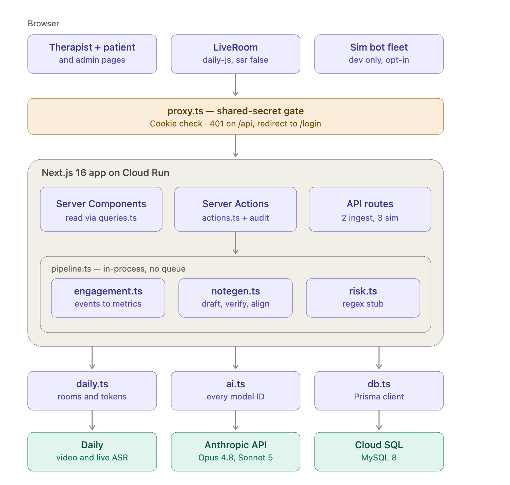
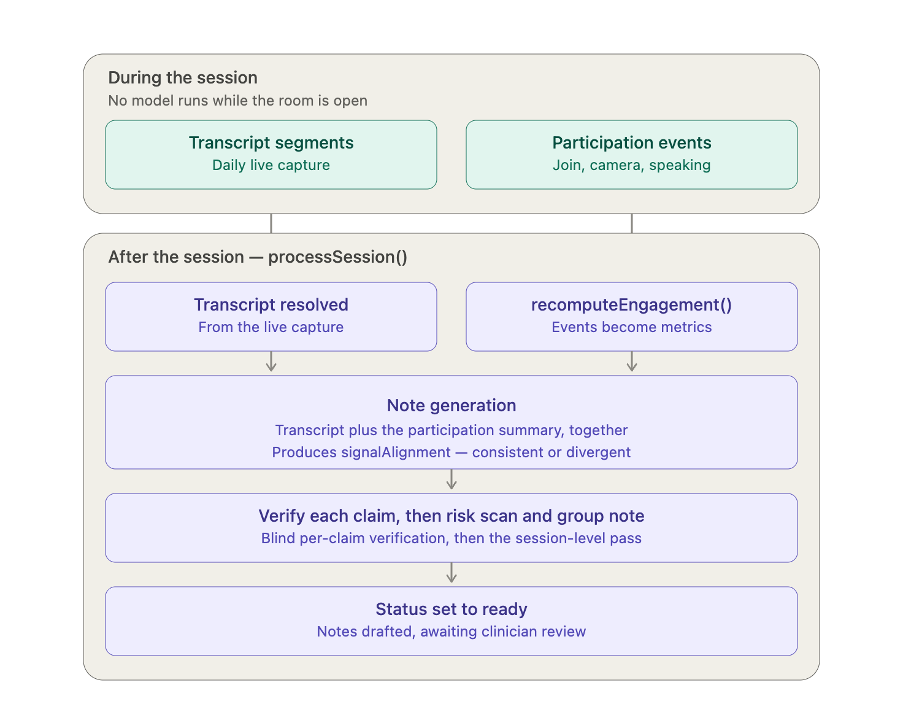
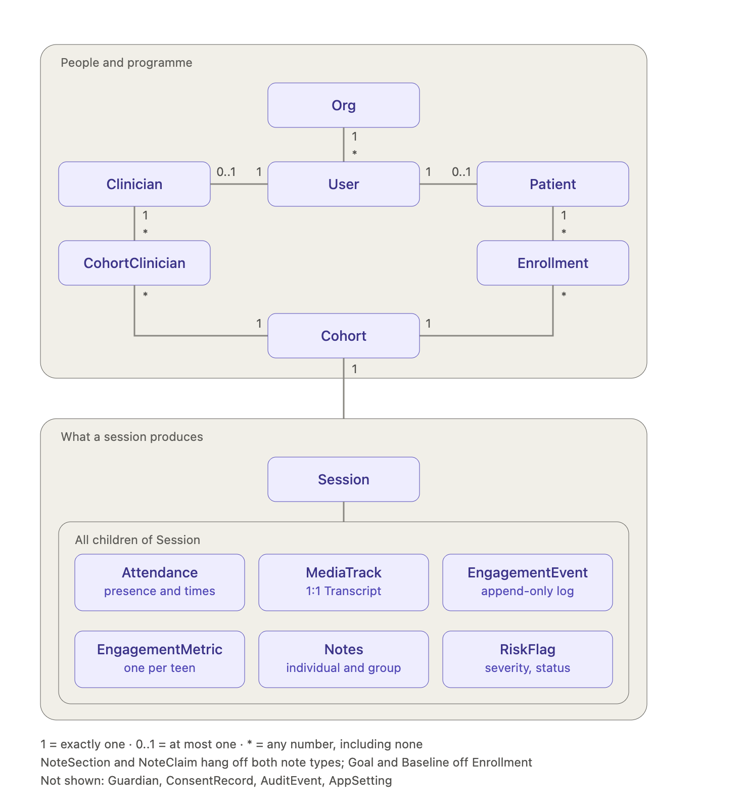

# BrioCare — Technical Design

## 1. System architecture



BrioCare is a single Next.js 16 application deployed as one Cloud Run service against MySQL 8 on
Cloud SQL. There is no separate backend and no internal API. Server Components read through the
query modules in `src/lib/` (`queries.ts`, `patient.ts`, `admin.ts`); Server Actions in `actions.ts`
and `admin-actions.ts` perform every mutation. Five API routes exist, each because the browser needs
something a Server Action can't give it: two ingest routes receive transcript segments and
participation telemetry flushed with `sendBeacon`, and three dev-only simulator routes proxy calls
that must keep API keys server-side (`sim/turn` to Anthropic, `sim/tts` to Deepgram) or drive the
bot fleet (`sim/[sessionId]/bots`).

Vendor code is confined to a small set of modules. On the server, `daily.ts` handles room and token
lifecycle, `ai.ts` holds the model IDs, `db.ts` builds the Prisma client, and `asr.ts` is the
transcription port — it selects the provider and gates the batch path. Nothing else on the server
imports a vendor SDK.

That buys one clean substitution and one partial. Moving inference to `AnthropicVertex` is a change
to `ai.ts` alone — the `messages` surface is identical, so no call site moves. Moving video to
LiveKit is not. `daily.ts` covers only the server side; the live room runs on `daily-js` in the
browser as a **call object** with our own UI — tiles, transcription events, participant state — and
none of that sits behind a port. That migration is one file on the server and a rewrite in the
client. The dev-only patient simulator is the remaining exception: its speech route calls Deepgram
directly rather than through the port, because it ships with the demo rather than the product.

Transcription runs one way today. Daily transcribes the room live, every connected client attributes
segments by participant and posts them to the ingest route, and `MediaTrack.gcsUri` holds a
`daily-live://` marker. Redundant capture is deliberate: the ingest route de-duplicates on timestamp
and text, so one participant closing their tab no longer costs the transcript. The recorded-audio
alternative behind `asr.ts` is implemented and verified against real audio, but the branch is
unreachable because it requires a real recording URL and no code writes one — wiring recording to
storage is what would activate it.

While the group is running, the system captures and displays but never infers. No model runs while
the room is open. Nothing in the product needs a response during the hour, so keeping inference out
of the room removes an entire class of failure from the clinical setting.

After the session, a batch pipeline resolves the transcript and recomputes engagement from the raw
events independently, then hands both to note generation together — the first point at which the two
streams meet. The transcript supplies what the teen said; the participation summary supplies the
measured signal, including direction against that teen's own baseline. Mechanism is in §5.

Three things are deliberately provisional. `proxy.ts` is a shared-secret gate over the whole
deployment, not authentication — there is no per-user identity, no roles, and no ownership checks on
any action. `processSession()` runs inside the request that triggers it, with no queue, retries, or
backpressure. And the pipeline is started by hand rather than by the session ending. All three are
Phase 2.

## 2. Technical stack


| Layer           | Choice                                                                                               |
| --------------- | ---------------------------------------------------------------------------------------------------- |
| App             | Next.js 16 (App Router) + React 19, TypeScript                                                       |
| Data            | Prisma 7 →**MySQL 8** (`prisma/schema.prisma` sets `provider = "mysql"`; local Docker on port 3307) |
| Video           | Daily (CPaaS), driven as a**call object** (`createCallObject`) with our own UI, not Daily Prebuilt   |
| Speech → text  | Deepgram, reached**through Daily's live transcription**                                              |
| Note generation | Claude —`NOTE_MODEL` and `VERIFY_MODEL` are both `claude-opus-4-8` (`src/lib/ai.ts`)                |

`ai.ts` also holds `DIRECTOR_MODEL` (`claude-sonnet-5`), which drives the dev-only AI-patient
simulator. It is not part of the product path.

## 3. Session lifecycle



`Session.status` is the spine of the whole system:

```
SCHEDULED ──► LIVE ──► ENDED ──► PROCESSING ──► READY
                                      │
                                      └──────► FAILED
```

- `SCHEDULED → LIVE` and `LIVE → ENDED` are driven by the therapist's **Start**/**End session**
  buttons (`setSessionStatus` in `actions.ts`). Ending a session also schedules the cohort's next
  one, unless the programme's fixed session count is already reached.
- `ENDED → PROCESSING → READY` is the batch pipeline (§5).
- The Daily room is provisioned **lazily** — only when status is `LIVE`. A scheduled session has no
  room, so a teen can't land alone in a room nobody started.

**The pipeline does not run when a session ends.** `setSessionStatus` updates the status, writes an
audit event, and schedules the next session — nothing more. Processing is triggered by a clinician
pressing **Generate notes** (`processSessionAction`), either on the ended live page or in note
review. There is no queue, no cron, no webhook. This is a deliberate Phase-1 simplification, but it
does mean an ended session sits with no notes until someone asks for them.

## 4. Live flow (during the session)

The rule during a live session is **capture only — the AI produces no output**. No prompts to the
clinician, none to the teens, no real-time risk detection. The clinician runs the room.

1. **Therapist starts the session.** Status → `LIVE`. The live page calls `ensureRoom(sessionId)`
   (idempotent create of a private Daily room, video and audio starting off) and `mintToken(...)` for
   a short-lived meeting token — owner for the clinician, member for each teen. The facilitator's
   token overrides the room default so they arrive unmuted; teens stay muted until they choose.
2. **Everyone joins on their own device.** This is the load-bearing design decision: one clean
   near-field stream per person, so **speaker identity is a property of the connection**, not
   something a model has to infer from a shared room.
3. **Behavioral events are captured.** `LiveRoom.tsx` listens to Daily participant events, buffers
   them, and POSTs to `/api/session/[id]/events`, which writes `EngagementEvent` rows. The route
   accepts only seven event types — `JOIN`, `LEAVE`, `CAMERA_ON`, `CAMERA_OFF`, `SPEAKING_START`,
   `SPEAKING_END`, `CHAT` — and its own comment notes "no transcript/PHI text."
4. **Speech is transcribed live.** Daily's transcription (Deepgram streaming under the hood) emits
   `transcription-message` events into the browser. The client buffers
   `{patientId, text, startMs, endMs}` and POSTs to `/api/session/[id]/transcript`, which appends to
   that teen's `Transcript.segments` and stamps the track `daily-live://<sessionId>`.
   - **Every connected client captures the same room-wide stream**, not just the facilitator's, and
     the server dedupes on `(startMs, text)`. This is why one clinician refresh no longer kills the
     transcript for the whole room.
   - **Domain prerequisite — this is not a per-room setting.** Transcription is a first-party Daily
     feature, but it ships **off** until enabled on the *domain*, and `startTranscription()` is
     rejected until it is. Two paths enable it:

     1. **Daily-bundled Deepgram** — paid plans only, billed per unmuted participant minute.
     2. **Bring your own Deepgram key** — attached to the domain, so ASR bills through your own
        Deepgram account. **This is what BrioCare uses**, because `DEEPGRAM_API_KEY` is already
        provisioned for TTS (`/api/sim/tts`) and this keeps ASR on that same bill.

     The domain had *neither* configured, which is why every `startTranscription()` call failed.
     Enabling path 2 is one REST call per Daily account:

     ```bash
     curl -X POST https://api.daily.co/v1/ \
       -H "Authorization: Bearer $DAILY_API_KEY" \
       -d '{"properties":{"enable_transcription":"deepgram:'"$DEEPGRAM_API_KEY"'"}}'
     ```

     Verify with `GET https://api.daily.co/v1/` → `config.enable_transcription` must be a
     `deepgram:…` string, not `null`. Leave `enable_transcription_storage` false: Daily should not
     retain transcripts, we persist the words ourselves (see "Audio is never written to disk").

     Without it the whole capture path is dead but *looks* healthy — mics publish, tiles go green,
     and only the empty transcript hints at it. `LiveRoom.tsx` now listens for
     `transcription-started` / `-error` (plus a 12s watchdog for the case where neither fires) and
     renders a `live` / `not running` chip, because `startTranscription()` returns `void` and
     reports failure asynchronously, so a bare `try/catch` around it catches nothing.
5. **What the clinician sees:** live speaking-time bars per member — accrued in the browser from
   Daily's active-speaker signal on a one-second tick — a running transcript, and an "AI silent"
   chip. Nothing is generated or suggested.

**Audio is never written to disk.** It travels from the teen's device → Daily → Deepgram's streaming
API and comes back as words. We persist the words. There is no `enable_recording` on the room
(`src/lib/daily.ts`), no start/stop-recording call, no recording webhook, and no storage client in
the project.

## 5. Batch flow (after the session)

`processSession(sessionId)` in `src/lib/pipeline.ts`. Sets status `PROCESSING`, and on any throw sets
`FAILED` rather than leaving a half-written session looking finished.

**Step 1 — Engagement.** `recomputeEngagement(sessionId)` turns raw `EngagementEvent` rows into an
`EngagementMetric` per teen: talk seconds, turns, camera %, presence %, chat count, combined into a
weighted, soft-capped **participation index** (talk 0.35, turns 0.25, camera 0.15, presence 0.15,
chat 0.10; each input capped so one loud member can't saturate the score). Status comes from the
delta against that teen's own `Baseline` — never against the cohort.

**Step 2 — Resolve a transcript, per teen.** Strict priority:

1. **Daily live capture** — the track is `daily-live://…` and has segments. *This is the only branch
   that fires on a real session.*
2. **Deepgram pre-recorded** — requires a real audio URL. **Unreachable today**, because nothing
   writes one (§1).
3. **Synthetic fixtures** (`src/lib/fixtures.ts`) — `profileForStatus()` picks one of six canned
   transcripts (`withdrawn`, `withdrawn_flagged`, `engaged`, `improving`, `brief`, `absent`) from the
   teen's engagement status and attendance. *This is what runs on seeded demo data.*

**Step 3 — Generate a grounded individual note** (`groundedIndividualNote` in `notegen.ts`), per teen,
four at a time:

- **Generate** — Claude drafts four sections plus goal signals, from that teen's transcript, their
  goals, the session module, and a one-line participation summary built from Step 1. It also returns
  `signalAlignment`, a structured verdict on whether the narrative and the measured signal tell the
  same story. Without it a note can read "engaged and forthcoming" while the caseload shows the same
  teen well below baseline, and a clinician skimming the prose never sees the contradiction.
- **Verify** — every claim is checked independently:
  - no evidence cited → `UNSUPPORTED`
  - metric evidence only → `SUPPORTED` automatically (it's our own measured data)
  - transcript evidence → a **second model call** judges whether the quotes substantiate the claim,
    returning `SUPPORTED` / `UNSUPPORTED` / `UNCERTAIN`. Claims citing both are shown both, so a
    sentence reconciling narrative with signal isn't penalised.

**Step 4 — Risk scan.** `scanForRisk()` runs over the transcript and writes `RiskFlag` rows with a
12-hour SLA. **This is a regex stub, not a clinical detector** — every flag's evidence is stamped
`[SYNTHETIC STUB — not a clinical detection]`. The workflow around it is real; the detector waits on
a signed-off clinical taxonomy.

**Step 5 — Group note.** One session-level note generated from all members' summaries. It is
aggregate prose; claim-level grounding rigor lives in the individual notes.

**Step 6 — Finish.** Status → `READY`, plus a `session.processed` audit event.

Notes are never merged on a re-run. Note writes are destructive-then-recreate inside a transaction,
and the pipeline refuses to write a note with zero sections rather than replacing real content with
an empty record — so a second pass can't leave a half-updated record in a chart.

## 6. Core data model



Only the entities the two flows touch:

- **Org → Clinician / Patient → Cohort → Enrollment** — an Enrollment carries the teen's `Goal` rows
  and their `Baseline` (the anchored participation index the engagement signal compares against).
- **Session** — one group meeting, with `index`, `module`, `status`.
- **EngagementEvent** — raw behavioral events: `JOIN`, `LEAVE`, `CAMERA_ON`, `CAMERA_OFF`,
  `SPEAKING_START`, `SPEAKING_END`, `CHAT`. No text content.
- **EngagementMetric** — the derived per-teen, per-session figures: talk seconds, turns, camera %,
  presence %, chat count, `participationIndex`, `status`.
- **MediaTrack → Transcript** — one per (session, patient). `Transcript.segments` is the text;
  `lowConfSpans` holds segments below 0.6 confidence.
- **IndividualNote → NoteSection → NoteClaim**, and **GroupNote → NoteSection** — the notes, their
  sections, and the per-claim evidence and verdicts.
- **RiskFlag** — one per detected hit, with evidence, `severity`, `status`, `disposition`.
- **AuditEvent** — written by every mutating action.

> `MediaTrack.gcsUri` is named for a Google Cloud Storage object. **No such object exists.** The
> field only ever holds a marker string: `daily-live://<sessionId>` or `synthetic://<profile>`. The
> name describes an intended future, not current behavior.
